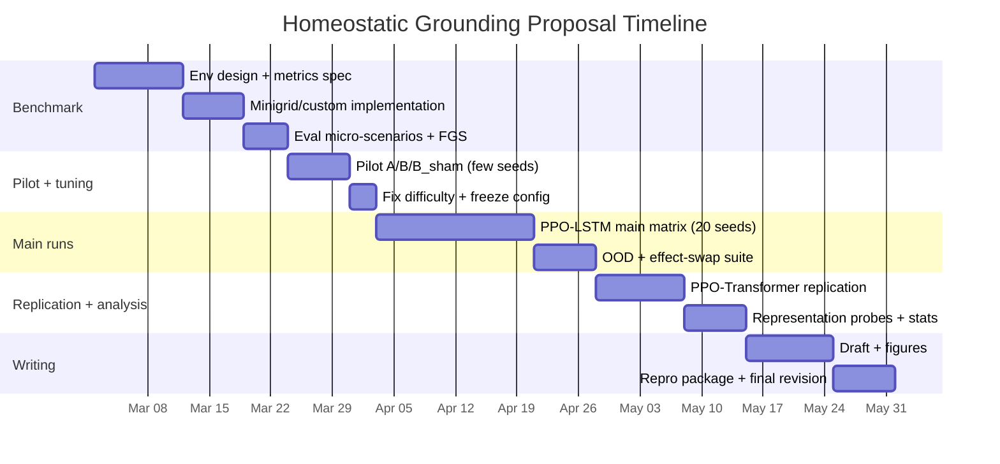

# Designing a Publishable Research Proposal on Homeostatic Signals for Functional Symbol Grounding in Partially Observable Survival RL

## Executive summary

This proposal targets a concrete, publishable question at the intersection of homeostatic reinforcement learning, interoception-inspired agent design, and symbol grounding: **do internal homeostatic/energy signals causally accelerate “functional symbol grounding” of object symbols under partial observability, and does queryable external knowledge amplify the effect?** The core experimental design is intentionally simple but reviewer-resistant: a controlled POMDP “survival” gridworld with symbolically distinct objects whose true effects are hidden, plus a matrix of agent conditions that separates (i) sparse terminal reward learning from (ii) interoceptive state observation and from (iii) action-contingent information acquisition (“query”) and retrieval. The conceptual bridge is grounded in (a) homeostatic RL formulations where value depends on internal state/drive reduction (not merely external reward), (b) symbol grounding theory emphasizing meaning grounded in sensorimotor contingencies, and (c) recent RL work where agents learn to ask for information/help or retrieve relevant knowledge. citeturn0search16turn0search15turn0search6turn1search7turn2search3turn4search6

The proposal becomes “top-conference/journal-quality” by directly addressing three predictable reviewer critiques:

1. **“It’s just extra information / reward shaping.”** Counter with **B_sham** (extra scalar of matched statistics but uninformative) and **B_perm** (break synchrony/causality of energy feedback), plus an optional **B_hidden-reward** condition that uses energy for internal reward while withholding energy observation. These isolate *structured interoceptive observability* as the mechanism. citeturn0search16turn4search0  
2. **“That’s not symbol grounding; it’s just value learning.”** Counter with a *metric stack* beyond episodic return: (i) a Functional Grounding Score (FGS) on local decisions, (ii) representation probes/diagnostics aligned with established probing practice, and (iii) zero-shot/generalization tests that break “pixel/symbol memorization” (skin swaps, remapped effects, OOD layouts). citeturn0search15turn2search9turn4search0  
3. **“Query conditions are underspecified.”** Ground the query mechanism in prior work on asking for knowledge/help and in formal models of costly observation, with clear costs, controlled accuracy/noise, and explicit A+Q vs B+Q interaction tests. citeturn0search6turn2search3turn1search7

The deliverable is a benchmark + causal experimental package: a minimal survival POMDP, a principled condition matrix, and a reproducibility-first statistical plan (seeds, confidence intervals, pre-registered hypotheses, and multiple-comparison control). citeturn4search12turn4search0

## Background and related work

### Homeostatic reinforcement learning and interoception as internally generated feedback

Homeostatic RL formalizes the idea that what looks like “reward” in animals is often derived from—and evaluated through—internal physiological variables (e.g., drive reduction relative to setpoints), not only exteroceptive outcomes. A key formal anchor is the model family developed by entity["people","Mehdi Keramati","computational neuroscientist"] and entity["people","Boris Gutkin","computational neuroscientist"], culminating in the eLife paper “Homeostatic reinforcement learning for integrating reward collection and physiological stability,” which links learning and action selection to internal-state dynamics and drive functions. citeturn0search16turn0search4

More recent perspective and review work argues that understanding reinforcement learning in biological agents requires treating “reward origins” as interoceptively mediated and state-dependent, rather than purely external sensory gratification. citeturn0search1turn0search13 A complementary modern framing places interoception (internal sensing/modeling) and allostasis (anticipatory control of bodily needs) into a control-theoretic lens, highlighting internal feedback as performance/error signals for regulation. citeturn4search11turn4search31

Empirically oriented homeostatic-RL papers have also begun modeling long-horizon foraging/nutritional behaviors using homeostatic RL agents, demonstrating that internal-state formulation changes learned strategies and risk tradeoffs over time. citeturn0search21turn4search15 These works motivate your hypothesis, but they typically do **not** operationalize “symbol grounding” as a measurable representational/behavioral phenomenon tied to object symbols under partial observability.

### Symbol grounding, affordances, and “functional” meaning

The classical symbol grounding problem argues that purely formal symbol manipulation cannot yield intrinsic meaning without grounding in sensorimotor capacities and the world. citeturn0search15turn0search3 The “functional” angle connects naturally to ecological/affordance theory: objects are meaningful in terms of **what they afford** an agent (what they provide “for good or ill”), i.e., action possibilities and consequences relative to the agent’s needs and capabilities. citeturn1search8

Modern ML/robotics affordance literature often focuses on predicting actions/object functions from vision and interaction data; surveys emphasize both the breadth of definitions and the importance of reproducible, well-specified benchmarks. citeturn2search2turn2search30turn2search22 This supports positioning your task as a *minimal, interaction-grounded affordance/meaning acquisition benchmark* where “symbol → effect-on-homeostasis” is the operational notion of meaning.

A recent high-impact thread uses the term “functional grounding” for aligning internal symbols/representations with environment dynamics in interactive settings. The GLAM approach studies functionally grounding language models through online RL and interaction, providing contemporary terminology and evaluation precedents for “functional grounding.” citeturn2search4turn2search0

### Querying external knowledge and costly information in RL

Your condition C (energy + queryable knowledge) connects to a growing body of RL research where agents learn to ask questions, request help, or retrieve relevant information. “Asking for Knowledge (AFK)” trains RL agents to query external knowledge using language and studies how query actions can improve learning under delayed rewards and large query spaces. citeturn0search6turn0search2

Closely related are “help-seeking” and intervention frameworks: Ask4Help learns how agents can leverage an expert in embodied settings, while “When to Ask for Help” studies learning to detect irreversible/danger states and proactively request interventions. citeturn2search3turn2search7 These are strong anchors for formalizing “QUERY” as an action with cost and benefit.

Finally, the query-to-knowledge idea can be grounded in formal RL models where observation is costly and action-contingent (ACNO-MDPs). This literature provides theoretical legitimacy for treating information acquisition as part of the decision process rather than an ad hoc add-on. citeturn1search7turn1search3

### Practical benchmark ecosystems and reproducibility expectations

For implementability and community adoption, small gridworld ecosystems like BabyAI and Minigrid/Miniworld show how carefully designed minimalist environments can become widely used benchmarks, especially for grounding and generalization studies. citeturn1search1turn1search2turn1search6

Deep RL evaluation norms increasingly emphasize variance, multiple seeds, careful reporting, and statistically meaningful comparisons; “Deep RL that Matters” is a canonical reference documenting how sensitive results can be to seeds/hyperparameters and why significance/standardized reporting matters. citeturn4search12turn4search0

### Related-work mapping table

| paper | year | contribution | relevance |
|---|---:|---|---|
| Homeostatic reinforcement learning for integrating reward collection and physiological stability | 2014 | formalizes homeostatic RL linking reward/value to internal drive reduction and internal-state dynamics | foundational for “internal energy/homeostasis as learning signal” citeturn0search16 |
| A Reinforcement Learning Theory for Homeostatic Regulation | 2011 | earlier formal HRL theory paper; frames homeostatic regulation as RL objective | strengthens theoretical lineage and novelty claims citeturn0search35 |
| Linking homeostasis to reinforcement learning: internal rewards and beyond | 2025 | review/perspective positioning HRRL and internal reward definition | supports framing and related-work completeness citeturn0search17turn4search3 |
| The interoceptive origin of reinforcement learning | 2025 | argues biological reinforcement signals originate internally and depend on internal state/goals | justifies “energy feedback” as biologically motivated grounding mechanism citeturn0search1turn0search13 |
| Interoception as modeling, allostasis as control | 2021 | control-theoretic account linking interoception to anticipatory regulation | supports mechanistic interpretation of internal signals as error/performance feedback citeturn4search11 |
| The Symbol Grounding Problem | 1990 | foundational articulation of symbol grounding as sensorimotor grounding problem | provides theoretical motivation for grounding claim citeturn0search15turn0search3 |
| The Theory of Affordances (excerpt) | 1979 | defines affordances as what the environment offers an agent, “for good or ill” | supports “functional meaning = action consequences relative to needs” citeturn1search8 |
| BabyAI: A Platform to Study the Sample Efficiency of Grounded Language Learning | 2018/2019 | benchmark suite for grounded instruction following and sample efficiency | benchmark precedent; methodology for controlled grounding tasks citeturn1search1turn1search13 |
| Minigrid & Miniworld libraries | 2023 | stable, minimalist gridworld ecosystem for RL research | practical base for your benchmark and reproducibility citeturn1search2turn1search6 |
| Asking for Knowledge (AFK) | 2022 | RL agents learn to query external knowledge via language; tackles delayed reward for “good queries” | primary prior work for your query condition(s) citeturn0search6 |
| Ask4Help | 2022 | agents learn to request expert help in embodied tasks; cost/benefit tradeoff | alternative “query/expert” paradigm; supports costed-query design citeturn2search3 |
| When to Ask for Help: Proactive Interventions in Autonomous RL | 2022 | detects irreversible states; proactively requests interventions | aligns with survival/danger framing and query triggers citeturn2search7 |
| Reinforcement learning with state observation costs in ACNO-MDPs | 2021 | formal framework where observing state incurs a cost; action-contingent observability | formalizes “query/measure” actions with costs citeturn1search7 |
| Large-Scale Retrieval for Reinforcement Learning | 2022 | semi-parametric retrieval to incorporate external information at decision time | positions “external knowledge” broadly as retrieval/lookup citeturn4search6turn4search2 |
| Retrieval Augmented Reinforcement Learning (R2A) | 2022 | integrates retrieval from stored trajectories/datasets into RL decision making | supports queryable memory/knowledge as general mechanism citeturn4search38 |
| Grounding Large Language Models… (GLAM) | 2023 | “functional grounding” of internal symbols via interactive environments and online RL | modern conceptual anchor for “functional grounding” terminology citeturn2search4turn2search0 |
| Deep Reinforcement Learning that Matters | 2017/2018 | documents reproducibility pitfalls; argues for multi-seed, careful reporting | justifies rigorous statistical plan and reporting format citeturn4search12turn4search0 |
| Human-level control through deep reinforcement learning (DQN) | 2015 | canonical DQN framework for value-based deep RL | baseline algorithm/tooling reference citeturn3search0 |
| Proximal Policy Optimization Algorithms (PPO) | 2017 | widely used, stable on-policy RL algorithm | alternative baseline; helps POMDP versions with recurrent encoders citeturn3search5 |
| Deep Recurrent Q-Learning (DRQN) | 2015 | adds recurrent memory to DQN for POMDPs | supports partial observability handling (LSTM encoder) citeturn3search6 |
| Stabilizing Transformers for RL (GTrXL) | 2020 | transformer variant stable in RL; memory over long horizons | supports “Transformer encoder” option for POMDP history citeturn3search3turn3search7 |

## Research gap, novelty claims, and hypotheses

### Precise problem statement

**Problem:** In a partially observable survival environment, an agent must learn the *functional meanings* of perceptual symbols (object appearances) whose latent effects are hidden, and must do so under sparse terminal reward where credit assignment is hard. The proposal tests whether **interoceptive observability of internal energy/homeostatic state** provides an immediate, structured internal signal that accelerates (i) correct symbol–effect association and (ii) representational encoding of these associations, and whether **queryable external knowledge** further accelerates grounding—especially when energy is observable. citeturn0search16turn0search15turn0search6turn1search7

### Novelty claim relative to prior work

A defensible novelty statement (and the one likely to survive expert review) is:

1. **Homeostatic RL exists, but it rarely measures symbol grounding.** HRL/HRRL papers primarily study reward definition, regulation behavior, or foraging strategies with internal drives, rather than causal tests of how internal observability changes *meaning acquisition* for exteroceptive symbols under sparse terminal reward. citeturn0search16turn0search17turn0search21turn4search15  
2. **Symbol grounding exists, but it rarely isolates homeostatic signals as the mechanism.** Foundational grounding theory motivates sensorimotor grounding, and recent “functional grounding” work offers evaluation vocabulary, but the specific causal role of homeostatic/interoceptive feedback in speed/quality of grounding is not typically isolated with sham/permutation controls. citeturn0search15turn2search4turn2search0turn1search8  
3. **Querying/asking-for-knowledge exists, but interaction with homeostatic observability is under-tested.** AFK and help-seeking literature demonstrate benefits of queries, but do not directly test whether internal-state observability changes how agents exploit queried knowledge *to ground meanings* in survival contexts. citeturn0search6turn2search3turn2search7

Importantly, your strongest publishable “new artifact” is not just the hypothesis; it is a **benchmark + metric stack + causal control matrix** that can become reusable, analogous to how BabyAI/Minigrid provide minimalist testbeds for grounding and generalization. citeturn1search1turn1search2turn4search12

### Hypotheses (pre-registered-style)

Let “grounding” be measured by a combination of (i) behavioral discrimination on local decisions, (ii) representation probe separability, and (iii) robustness under symbol/appearance shifts.

- **H1 (Interoceptive acceleration):** Agents with observable energy (B) achieve higher grounding metrics (FGS, probe accuracy) earlier than terminal-only baseline (A), controlling for architecture/compute. citeturn0search16turn0search1  
- **H2 (Causal structure, not extra dimension):** B outperforms B_sham and B_perm; thus acceleration requires *structured, causally aligned* internal feedback, not merely extra observation bandwidth. citeturn4search12  
- **H3 (Query amplification and interaction):** B+Q outperforms A+Q and B (interaction), suggesting that interoceptive feedback increases the utility of external hints for grounding. citeturn0search6turn1search7  
- **H4 (Generalization):** Improvements persist under symbol reskinning/OOD layouts; B and B+Q degrade less than A, implying meaning is grounded in function (effect) rather than memorized perceptual tokens. citeturn1search1turn2search4

## Formal task definition

This section proposes a benchmark that stays close to your original design while upgrading it to “POMDP-grade” and reviewer-proof. It builds directly on your draft environment, three-condition framing, and the use of an FGS-style grounding metric. fileciteturn0file0

### POMDP specification

Define the benchmark as a POMDP \( \mathcal{M} = \langle \mathcal{S}, \mathcal{A}, \mathcal{O}, T, \Omega, R, \gamma \rangle \).

**State space \(\mathcal{S}\)** includes:
- Grid layout \(L\) (walls, empty, exit).
- Agent position \(p_t\).
- Object set \(\{(p^i_t, \sigma^i, \theta^i)\}_{i=1}^K\) where:
  - \(p^i_t\) is object position,
  - \(\sigma^i\) is the **visible symbol/appearance ID** (e.g., color/letter),
  - \(\theta^i\) is the **latent effect type** (harm/benefit/neutral) and/or parameter \(\Delta E(\theta^i)\).
- Internal energy \(E_t \in [0, E_{\max}]\).

**Actions \(\mathcal{A}\)**:
- Navigation actions: \(\{\text{up, down, left, right, stay}\}\).
- Optional “interact” if you want to decouple stepping-on from consuming.
- Query actions (for query-enabled conditions): \(\{\text{query}(\sigma): \sigma \in \Sigma\}\), optionally restricted to “symbols observed in current episode” to avoid trivial enumeration. This aligns with query-as-action frameworks and “ask for knowledge” settings. citeturn0search6turn1search7

**Transition \(T\)**:
- Movement updates position with wall collisions.
- Step energy cost: \(E_{t+1} \leftarrow E_t - c_{\text{step}} + \Delta E(\theta^i)\) if interaction with object \(i\) occurs.
- Episode termination if \(E_{t+1} \le 0\) (death) or agent reaches exit (success), or horizon \(H\). This matches “survival pressure” framing used in homeostatic settings. citeturn0search16turn4search15

**Observation \(\mathcal{O}\)** and emission model \(\Omega\)** (partial observability)**:
To be unambiguously a POMDP (beyond “latent object effects”), use *spatially local* perception:

- Egocentric \(w \times w\) field-of-view (default \(w=5\)), with each cell encoded as {wall, empty, exit, object symbol \(\sigma\)}.
- Optionally include the previous action \(a_{t-1}\) (common in POMDP encoders).
- **Energy observation** depends on condition (A: hidden; B: visible; etc.).

POMDP relevance and memory architectures are backed by standard recurrent/transformer RL references. citeturn3search6turn3search3turn3search7

**Reward \(R\)** (kept sparse by design):
- \(+1\) on reaching exit.
- \(-1\) on death.
- \(0\) otherwise.
This isolates the effect of energy observability from external shaping reward.

**Discount \(\gamma\)**:
- Default \(\gamma = 0.99\) (sensitivity tested in ablations).

### Default environment parameters (explicit, but adjustable)

Below are reasonable defaults suitable for first submission-quality results; list them explicitly so reviewers can see you controlled complexity.

| parameter | default | rationale |
|---|---:|---|
| grid size | \(9 \times 9\) | slightly larger than toy \(7 \times 7\), still cheap; pushes partial observability benefits |
| FOV window \(w\) | 5 | common egocentric view size in gridworld benchmarks |
| object symbols \(|\Sigma|\) | 3 (harm/benefit/neutral) | clean causal analysis; scale-up in ablations |
| objects per episode \(K\) | 3–5 | ensures exploration pressure and repeated exposures |
| effect magnitudes \(\Delta E\) | \(\{+30, 0, -40\}\) | strong enough to matter under survival pressure |
| initial energy \(E_0\) | 100 | allows short exploration but requires correct choices |
| energy cap \(E_{\max}\) | 120 | prevents trivial stockpiling |
| step cost \(c_{\text{step}}\) | 2–5 | tune to control survival difficulty |
| horizon \(H\) | 60–120 steps | enough to require memory and planning |
| query cost \(c_{\text{query}}\) | 5–15 energy | makes query valuable but not free |
| mapping stationarity | fixed during training; swapped at transfer | enables “meaning acquisition” then re-grounding test |

Your original simpler “global object positions but hidden effects” variant can be kept as an auxiliary “low-POMDP” setting for quick pilots and debugging; the local-FOV version is the submission-grade benchmark. fileciteturn0file0

### External knowledge source specification (for query)

To avoid ambiguity and leakage accusations, define a **knowledge oracle** \(K\) that returns information about symbol \(\sigma\).

Recommended staged design (increasing realism):

1. **Deterministic attribute oracle:** returns \(K(\sigma) \in \{\text{harm, neutral, benefit}\}\).  
2. **Noisy oracle:** returns correct label with prob \(1-\epsilon\) and otherwise random; sweep \(\epsilon\) in ablations.  
3. **Text tokenization (optional):** return a short text hint embedded via a learned embedding layer; this remains aligned with AFK style “language query” while keeping complexity bounded. citeturn0search6turn1search7

## Experimental design, metrics, and statistical plan

### Condition matrix (core, controls, and interaction tests)

Your base A/B/C map naturally into a more rigorous matrix that directly tests causality and interaction.

**Core conditions**
- **A (terminal-only):** sparse terminal reward; energy hidden.
- **B (energy-observed):** same reward; energy observed.
- **B+Q (energy + query):** same as B plus query actions.
- **A+Q (query without energy):** isolates whether query alone helps without interoceptive grounding.

**Critical controls**
- **B_sham:** observe a scalar matched to energy’s scale/variance but independent of true energy trajectory (e.g., random walk, shuffled across episodes).
- **B_perm:** observe energy with broken temporal alignment (e.g., delayed by \(d\), or permuted within trajectory), destroying immediate causal interpretability.

**Optional mechanistic separations (strong but not strictly required)**
- **B_hidden-reward:** energy hidden, but internal reward includes drive reduction / energy change as intrinsic term. This tests “is it observation or reward definition that matters?” and connects directly to HRL framing. citeturn0search16turn0search17  
- **Curiosity baseline:** add an intrinsic exploration baseline (kept secondary) to argue your gain is not “any dense signal.” (Include only if bandwidth allows.)

### Experimental matrix table

| condition | hypothesis tested | expected outcome if theory is correct |
|---|---|---|
| A | baseline grounding under sparse terminal reward | slow FGS rise; brittle generalization; weaker probes |
| B | H1: interoceptive acceleration | faster FGS and probe separability than A |
| B_sham | H2: extra scalar ≠ grounding | similar to A (or only marginal gain), worse than B |
| B_perm | H2: causal alignment/time synchrony matters | worse than B; potentially near A depending on break severity |
| A+Q | whether knowledge queries help without energy | improves return somewhat; limited grounding unless oracle is very strong |
| B+Q | H3 interaction: energy makes queries more interpretable/useful | best sample efficiency, grounding, and lower death rate |
| (optional) B_hidden-reward | separates observation vs reward-definition mechanisms | if observation is key, remains closer to A than B; if reward-definition dominates, improves return but probes may differ |

The key publishable claim is typically: **B > A, B > B_sham/B_perm, and B+Q > A+Q and B**, with improvements persisting on generalization tests. citeturn4search12turn0search6turn1search7

### Metrics stack (what reviewers expect)

A top-tier evaluation should report *both performance and grounding evidence*.

#### Performance metrics
- **Episodic return** (mean, median, distribution) under a consistent evaluation protocol.
- **Success rate** (exit reached) and **survival rate** (no death), because survival tasks can have multimodal outcomes.

These remain essential but are not sufficient for grounding claims.

#### Functional Grounding Score (FGS)

To avoid confounds where the agent walks past an object for navigation reasons, define FGS primarily on **local decision contexts**:

- Generate evaluation micro-scenarios where the agent is placed adjacent to a visible object symbol \(\sigma\), with controlled alternatives (approach vs avoid).  
- Measure \(P(\text{approach} \mid \sigma)\) and compute:
\[
\text{FGS} = \mathbb{E}_{\sigma \in \Sigma_{\text{benefit}}} P(\text{approach} \mid \sigma) \;-\; \mathbb{E}_{\sigma \in \Sigma_{\text{harm}}} P(\text{approach} \mid \sigma).
\]
This operationalizes “meaning” as affordance-like functional valence. citeturn1search8turn0search15

Report:
- **FGS vs environment steps** learning curves,
- **Time-to-threshold** (e.g., first step where smoothed FGS > 0.5 for \(m\) eval points),
- **FGS-AUC** for sample-efficiency comparisons.

#### Representation probes (grounding in the model, not just behavior)

In addition to behavior, test whether the learned encoder/hidden state contains linearly accessible information about symbol effects.

- Train a **linear probe** on frozen hidden representations \(h_t\) to predict effect class (harm/neutral/benefit) for the observed symbol \(\sigma\) or for imminent interaction outcome.
- Report probe accuracy vs training steps and on OOD (reskinned symbols or new layouts).

Probing is common as a diagnostic method for learned representations; include careful caveats (probe results are diagnostic, not definitive). citeturn2search9turn2search13turn2search1

#### Zero-shot/generalization tests (critical for “symbol” claims)

At least three generalization regimes are recommended:

1. **Symbol reskinning:** permute visual IDs \(\sigma\) while keeping effect mapping \(\theta(\sigma)\) unchanged. True grounding should transfer via function, not appearance memorization.  
2. **Layout OOD:** larger grid or different wall topology distribution.  
3. **Effect remapping / “re-grounding”:** swap harmful/beneficial mapping post-training and measure re-learning speed (your H3-style test).  

Tie these to the “functional grounding” vocabulary used in modern interactive grounding literature. citeturn2search4turn1search1turn1search2

### Statistical plan (submission-grade)

Because deep RL is high variance, your analysis should look like a reproducibility paper, not a single-seed demo. citeturn4search12turn4search0

**Sampling / seeds**
- Use **N = 20–40 seeds per condition** for the main algorithm (start with 20; scale if variance is high).
- Use the *same set of seeds* across conditions for paired comparisons where possible (paired by environment RNG seeds).

**Primary endpoints (pre-specify)**
- Endpoint 1: FGS-AUC over a fixed budget of environment steps.
- Endpoint 2: time-to-FGS-threshold.
- Endpoint 3: OOD FGS and OOD probe accuracy after fixed training.

**Confidence intervals**
- Report **95% bootstrap CIs** over seeds for AUC and endpoint differences.
- For learning curves: bootstrap across seeds at each x-axis point, or use functional data summaries (AUC) to avoid multiple-testing across time.

**Hypothesis tests**
- Prefer **paired permutation tests** (paired seeds) or **Mann–Whitney U** (unpaired) for AUC/time-to-threshold.
- Correct multiple comparisons across condition pairs via Holm–Bonferroni (pre-specify which comparisons are confirmatory: B vs A; B vs B_sham; B+Q vs A+Q).  
- Provide effect sizes (Cliff’s delta or standardized mean difference) alongside p-values.

**Reporting**
- Include full hyperparameter ranges and either (i) a fixed tuned set used across all conditions or (ii) a budgeted tuning protocol applied equally, as recommended by reproducibility critiques. citeturn4search12

### Ablations and controls to anticipate reviewer critiques

Ablations should be explicitly tied to anticipated critiques:

- **Info-content control:** B_sham, B_perm (already core).
- **Survival pressure sweep:** vary \(c_{\text{step}}\) and \(E_0\); show regime where homeostatic observability matters most (moderate difficulty), plus failure modes (too easy/too hard).  
- **Interoception noise:** add observation noise to energy in B and B+Q to test robustness (links to interoception imperfections). citeturn0search1turn4search11  
- **Query reliability/cost:** sweep oracle noise \(\epsilon\) and energy query cost; evaluate when querying is optimal and when it hurts (ties to costly observation frameworks). citeturn1search7turn0search6  
- **Architecture invariance:** replicate key results on two architectures (e.g., PPO-LSTM and PPO-Transformer) to show the effect is not an artifact of one model class (important for top venues). citeturn3search5turn3search6turn3search3

### Experimental flow diagram (mermaid)

```mermaid
flowchart TD
  A[Environment: POMDP survival grid] --> B[Agent receives observation o_t]
  B --> C{Condition?}

  C -->|A: terminal-only| Aobs[Obs: local grid symbols (no energy)]
  C -->|B: energy observed| Bobs[Obs: local grid symbols + E_t]
  C -->|B_sham/B_perm| Cobs[Obs: local grid symbols + E'_t]
  C -->|A+Q| AQobs[Obs: local grid symbols (no energy) + query channel]
  C -->|B+Q| BQobs[Obs: local grid symbols + E_t + query channel]

  Aobs --> P[Policy/value network]
  Bobs --> P
  Cobs --> P
  AQobs --> P
  BQobs --> P

  P --> Act[Action a_t: move / (optional) interact / (optional) query(σ)]
  Act --> A
  A --> Dyn[State update: positions + energy dynamics]
  Dyn --> Term{Terminate? death/exit/H}
  Term -->|yes| Rterm[Terminal reward ±1]
  Term -->|no| R0[Reward 0]

  Dyn --> Metrics[Logging: return, survival, FGS contexts, representations]
  Metrics --> Eval[Periodic evaluation: local decision tests + probes + OOD]
```

## Minimal implementation details and compute/resource plan

### Algorithmic choices (why multiple baselines help publication)

A top-conference submission is stronger if your claim holds across at least one value-based and one policy-based approach, *or* across two POMDP-capable variants.

Recommended minimal set:

- **PPO + recurrent encoder (LSTM):** stable and widely used; handles POMDP history naturally. citeturn3search5turn3search6  
- **PPO + Transformer encoder (GTrXL-style or compact Transformer):** aligns with your “Transformer encoder” requirement and provides a modern memory baseline for partial observability. citeturn3search3turn3search7  
- Optional: **DRQN** (recurrent DQN) if you want a value-based confirmation; but you can keep it as secondary to avoid ballooning scope. citeturn3search6

### Observation encoding and architecture sketches

For local-FOV grid observation, a common architecture is:

- **Encoder:** small CNN over \(w \times w\) tile embeddings (each tile embedding learned; or one-hot then linear).
- **Memory:** LSTM (hidden size 128–256) or compact Transformer (layers 2–4, heads 2–4).
- **Heads:** policy/value heads (PPO) or Q-head (DRQN).

These choices align with standard DQN/PPO and POMDP encoders from the literature. citeturn3search0turn3search5turn3search6turn3search3

### Hyperparameter ranges (explicit, bounded)

A reviewer-friendly approach is to predefine ranges and either (i) fix a single tuned configuration across conditions or (ii) do a *small, equal-budget* sweep per algorithm but shared across conditions.

Suggested ranges:

- PPO learning rate: \(1\mathrm{e}{-4}\) to \(3\mathrm{e}{-4}\)
- PPO clip: 0.1–0.2
- GAE \(\lambda\): 0.95
- Entropy bonus: 0.0–0.01
- Batch size: 2k–16k steps/iteration (vectorized envs)
- Discount \(\gamma\): 0.97–0.995 (ablation)
- LSTM hidden size: 128/256
- Transformer: 2–4 layers, 2–4 heads, model dim 128–256

### Environment implementation substrate

Two defensible implementation paths:

1. **Build on Minigrid/Miniworld:** fastest path to robust rendering, wrappers, vectorization, and standard API; friendly to reproducibility and community reuse. citeturn1search2turn1search10turn1search22  
2. **Build a custom Gymnasium-style env:** acceptable if you keep it minimal and provide complete code, but Minigrid reduces engineering risk.

Given the “publishable benchmark” angle, Minigrid-based implementation is often an advantage. citeturn1search2turn1search6

### Compute estimates and scale (pragmatic but credible)

Because the environment is lightweight, the main cost comes from multi-seed training and OOD evaluations, not from environment stepping.

A concrete, conservative estimate for PPO (vectorized envs):

- Steps per run: 5–20 million env steps (depending on difficulty; tune once, then fix).
- Wall-clock per run on 1 modern GPU: ~0.5–2 hours (implementation-dependent).
- Runs: 6 conditions × 20 seeds = 120 runs (main algorithm) → ~60–240 GPU-hours.
- Add a second architecture replication (Transformer) at 10 seeds → +30–120 GPU-hours.
- Total: roughly **100–400 GPU-hours** for submission-quality results, plus CPU time for evaluation/probes.

This budget is consistent with what is typically expected for a rigorous deep RL study with multi-seed confidence intervals. citeturn4search12

### Timeline and resource budget table

| phase | duration | deliverables | compute budget (rough) | hardware |
|---|---:|---|---:|---|
| Benchmark finalization | 1–2 weeks | environment + logging + evaluation micro-scenarios | 0–10 GPU-hours | CPU + 1 GPU |
| Pilot runs | 1 week | verify A vs B vs B_sham trend; tune difficulty | 10–30 GPU-hours | 1 GPU |
| Main experiment (PPO-LSTM) | 2–3 weeks | 6-condition matrix × 20 seeds; curves + endpoints | 60–240 GPU-hours | 1–2 GPUs |
| Replication (PPO-Transformer) | 1–2 weeks | key conditions replicated; robustness check | 30–120 GPU-hours | 1 GPU |
| Probes + OOD suite | 1 week | probing scripts; reskin/layout/effect swap results | 10–40 GPU-hours | CPU + 1 GPU |
| Paper writing + artifact prep | 2 weeks | submission-quality draft; code release | minimal | — |

### Mermaid timeline (gantt)



## Expected results, interpretation, limitations, and concrete next steps

### Expected results (pattern-level, not overfit to a single curve)

If the hypothesis is correct, you should see a robust ordering:

- **B+Q** learns fastest and achieves highest grounding/generalization.
- **B** learns faster than **A** on FGS and probes, even when episodic return differences are modest (important: grounding metrics can show earlier separation than return).
- **B_sham** and **B_perm** collapse toward **A**, demonstrating the effect is not “any extra scalar” but **structured, causally aligned interoceptive feedback**.
- **A+Q vs B+Q:** B+Q shows a stronger ability to translate hints into correct symbol–function associations (interaction effect), while A+Q may improve performance in a more brittle way (e.g., exploiting oracle labels without stable internal grounding). citeturn0search6turn1search7turn4search12

### How to interpret alternative outcomes (reviewer-proofing)

- **If B ≈ A but B+Q ≫ A+Q:** suggests energy observability mainly helps *utilize queried semantics* rather than grounding independently—still publishable, but the narrative becomes “interoception as an interface for knowledge use.” citeturn0search6turn0search1  
- **If B_sham helps almost as much as B:** indicates your benchmark may be too easy or that the agent exploits the extra scalar as a time/episode counter. Fix by (i) randomizing episode length, (ii) randomizing step cost slightly, or (iii) increasing POMDP difficulty/test with symbol reskinning. citeturn4search12  
- **If query dominates everything (A+Q ≈ B+Q):** the oracle is too strong or too cheap. Increase query cost, add noise, restrict query targets (must reference currently observed symbols), and evaluate generalization where memorizing oracle answers is insufficient. citeturn1search7turn0search6

### Risks and limitations

1. **Conceptual risk:** Some reviewers may argue “energy is part of state, so of course observing it helps.” You should embrace this and make the claim precise: *which properties of internal observation matter?* That’s exactly what B_sham/B_perm test. citeturn4search12  
2. **Scope risk:** Adding language-based querying can balloon the project. Keep query semantics minimal (structured label / short-token hint) and treat language as optional extension, anchored to AFK. citeturn0search6  
3. **Generalization risk:** If grounding gains fail under reskinning, the benchmark may be measuring superficial correlations. That’s why reskin/OOD and local-decision tests are non-negotiable. citeturn2search4turn1search1  
4. **Reproducibility risk:** Deep RL variance can wash out effects unless you run sufficient seeds and report robust statistics. citeturn4search12turn4search0

### Concrete next steps (high-leverage, minimal ambiguity)

1. **Finalize benchmark spec in writing (1–2 pages):** freeze parameters, observation, action, query policy, and evaluation contexts before large runs; treat as a preregistered protocol. citeturn4search12  
2. **Implement environment with deterministic logging of “local decision contexts”:** every time an object symbol enters the FOV adjacent ring, record available actions and chosen action for FGS computation (this makes FGS cheap and stable).  
3. **Run a 3-seed pilot for A/B/B_sham to validate directionality:** if B_sham ≈ B, adjust benchmark difficulty before scaling.  
4. **Lock hyperparameters once, then run the full seed matrix:** avoid per-condition tuning to prevent “tuned advantage” accusations. citeturn4search12  
5. **Add OOD reskin test early (before main run completes):** if reskin fails, fix representation/evaluation mismatch immediately.  
6. **Write the paper in parallel using the “artifact” framing:** emphasize benchmark + causal controls + grounding metrics, not only performance.

### One-paragraph abstract for the proposed paper

We propose a controlled partially observable survival benchmark to test whether **interoceptive observability of internal homeostatic energy** causally accelerates **functional symbol grounding** in reinforcement learning agents. In the environment, visually distinct objects have hidden beneficial, harmful, or neutral effects on an internal energy variable that governs survival, while external rewards remain sparse and terminal-only. We compare (A) a terminal-reward-only baseline, (B) an energy-observing agent, and (C) an energy-observing agent that can **query an external knowledge source** at a cost, alongside sham/permutation controls that match observation bandwidth while breaking causal structure. We evaluate not only episodic return but also a Functional Grounding Score based on local decisions, representation probes of effect encoding, and zero-shot generalization under symbol reskinning and effect remapping. We hypothesize that structured, causally aligned internal energy signals yield faster and more robust grounding than terminal reward alone, and that queryable knowledge further amplifies grounding when interoceptive feedback is available. citeturn0search16turn0search15turn0search6turn1search7turn2search4turn4search12